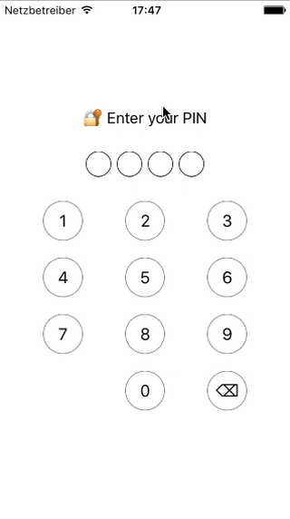
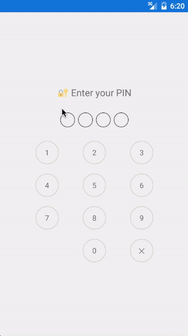

# PIN keyboard for Xamarin.Forms

<pre><code> </code></pre>

## Usage

1. Add the following NuGet package: https://www.nuget.org/packages/FormsPinView/  
    
    _OR_
    
    add [FormsPinView.Core](FormsPinView/FormsPinView.Core), [FormsPinView.iOS](FormsPinView/FormsPinView.iOS), and [FormsPinView.Droid](FormsPinView/FormsPinView.Droid) to your solution.
1. Initialize iOS and Android renderers:

        // iOS:
        public override bool FinishedLaunching(UIApplication app, NSDictionary options)
        {
            ...
            global::Xamarin.Forms.Forms.Init();
            PinItemViewRenderer.Init();
        }
        
        // Android:
        protected override void OnCreate(Bundle bundle)
        {
            ...
            global::Xamarin.Forms.Forms.Init(this, bundle);
            PinItemViewRenderer.Init();
        }

1. Add `PinView` to your page:
        
        ...
        xmlns:local="clr-namespace:FormsPinView.Core;assembly=FormsPinView.Core"
        ...
            <local:PinView
                HorizontalOptions="CenterAndExpand"
                VerticalOptions="CenterAndExpand"
                TargetPinLength="4"
                Validator="{Binding ValidatorFunc}"
                Success="Handle_Success" />
        
1. `PinView` is MVVM-ready, so you can bind the following properties:

| Property | Type | Description | Default | Required |
|---------------------|---------------------------|----------------------------------------------------------------------------------------------|---------|----------|
| `Validator` | `Func<IList<char>, bool>` | Function to check entered PIN | `null` | **Yes** |
| `PinLength` | `int` | The PIN length | 4 | No |
| `SuccessCommand` | `ICommand` | Invoked when the correct PIN is entered | `null` | No |
| `ErrorCommand` | `ICommand` | Invoked when an incorrect PIN is entered | `null` | No |
| `ClearAfterSuccess` | `bool` | Indicates whether the entered PIN should be cleaned or not after it was confirmed as correct | true | No |
| `BorderColor` | `Color` | View tint color. | Gray | No |
| `Color` | `Color` | View basic color. | Black | No |
| `RippleColor` | `Color` | View touch-effect color. | Gray | No |

## TODO

- [x] Use `AbsoluteLayout` instead of `Grid`, no XAML
- [x] Colorizing
- [ ] Randomizing the numbers order
- [ ] CI builds
- [ ] UI tests

## Changelog

### 2.1.0-pre1

- Root container changed from `Grid` to `AbsoluteLayout`
- Allowed to configure view colors: see `BorderColor`, `Color`, and `RippleColor`
- Removed `EmptyCircleImage` and `FilledCircleImage` properties

### 2.0.0

- Released *2.0.0-pre1* as a stable version

### 2.0.0-pre1

- Removed `Title` property: now you have to implement it manually in your UI
- Refactored the ViewModel API (splitted into bindable properties)
- Namespaces changed from `PCL` to `Core`.
- Allowed to change the PIN length dynamically as well as PIN symbols

### 1.1.1

- Released *1.1.1-pre1* as a stable version

### 1.1.1-pre1

- Fixed `NSInternalInconsistencyException` crash on iOS

### 1.1.0

- .NET Standard 2.0 is now supported
- PCL support is dropped

### 1.0.1

- Changed PCL profile to 259
- Added F# sample

### 1.0.0

- Intilial release 

## License

BSD 2-Clause.
